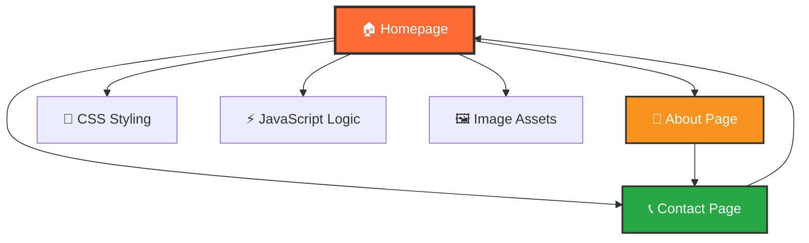

<div align="center">

# ⚡ Ashok Power Solution ⚡
### *Powering the Future with Innovation*


[](https://ashokpowersolution.com)
[](https://github.com/Priyanshu84iya)
[](tel:+919467038500)

---


</div>

## 🌟 **Project Overview**

> A cutting-edge, fully responsive website for **Ashok Power Solution** - Haryana's premier electrical and automation service company. Built with modern web technologies and designed for optimal user experience across all devices.

<details>
<summary>🚀 <strong>Quick Demo</strong></summary>

```bash
🏠 Homepage: Hero slider + Services showcase
📖 About: Company story + Founder profile  
📞 Contact: Interactive form + Business info
```

</details>

---

## 🎯 **Key Features**

<table>
<tr>
<td width="50%">

### 🎨 **Design Excellence**
- ✨ Modern gradient UI/UX
- 📱 Mobile-first responsive design
- 🎭 Smooth animations & transitions
- 🎪 Interactive hover effects
- 🖼️ Auto-advancing image slider

</td>
<td width="50%">

### ⚡ **Technical Features**
- 🔥 Vanilla JavaScript (No frameworks!)
- 🎯 SEO optimized structure
- � Performance optimized
- 🛡️ Security best practices
- 📱 Touch-friendly interactions

</td>
</tr>
</table>

---

## 🏗️ **Website Architecture**

<div align="center">



</div>

### 📄 **Page Breakdown**

<details>
<summary>🏠 <strong>Homepage (index.html)</strong></summary>

- 🎬 **Hero Section**: Auto-advancing slider with 3 professional slides
- 🛠️ **Services Grid**: Interactive cards showcasing electrical services
- 🏆 **Why Choose Us**: Company highlights and achievements
- 📞 **Call-to-Action**: Strategic conversion elements
- 🦶 **Footer**: Complete contact information

</details>

<details>
<summary>📖 <strong>About Page (about.html)</strong></summary>

- 👨‍💼 **Founder Profile**: Mr. Ashok Kumar's professional biography
- 🏢 **Company Story**: Mission, vision, and values
- 🔧 **Services Deep-dive**: 
  - AC/DC & Servo Drives
  - PLC, HMI, UPS Systems
  - LT, HT, PCC, MCC, APFC Panels
  - Industrial Sensors & Modules
- 🤝 **Brand Partners**: ABB, Schneider, Delta, L&T

</details>

<details>
<summary>📞 <strong>Contact Page (contact.html)</strong></summary>

- 📋 **Smart Contact Form**: Real-time validation & feedback
- 📍 **Location Cards**: Interactive contact information
- 🗺️ **Google Maps**: Embedded location finder
- ⏰ **Business Hours**: Operating schedule
- 🚨 **Emergency Contact**: 24/7 service availability

</details>

---

## 🛠️ **Tech Stack & Tools**

<div align="center">


</div>

### 📦 **Dependencies**

```json
{
  "external_libraries": {
    "Font Awesome": "6.0.0",
    "Google Fonts": ["Roboto", "Open Sans"],
    "Google Maps": "Embedded API"
  },
  "features": {
    "responsive_design": "CSS Grid & Flexbox",
    "animations": "CSS3 Transitions",
    "interactivity": "Vanilla JavaScript",
    "icons": "Font Awesome Icons"
  }
}
```

---

## 🎨 **Design System**

<table>
<tr>
<td>

### 🎭 **Color Palette**
```css
Primary:   #FF6B35 🔥
Secondary: #F7931E 🌟
Dark:      #1e1e1e ⚫
Light:     #f8f9fa ⚪
Success:   #28a745 ✅
Danger:    #dc3545 ❌
```

</td>
<td>

### 📱 **Responsive Breakpoints**
```css
📱 Mobile:     < 768px
📟 Tablet:     768px - 1023px
💻 Laptop:     1024px - 1199px
🖥️ Desktop:    ≥ 1200px
```

</td>
</tr>
</table>

---

## 📁 **Project Structure**

<div align="center">

```
🏗️ ashok-power-solution/
├── 📄 index.html          # 🏠 Homepage
├── 📄 about.html           # 📖 About page  
├── 📄 contact.html         # 📞 Contact page
├── 📄 README.md            # 📚 Documentation
├── 📁 css/
│   └── 🎨 style.css       # 💫 Main stylesheet
├── 📁 js/
│   ├── ⚡ script.js        # 🧠 Core functionality
│   └── 🎬 slider.js        # 🎪 Image slider logic
└── 📁 images/
    ├── 🏢 logo.png         # 🎯 Company logo
    ├── 🖼️ slide1.jpg       # 🎬 Hero image 1
    ├── 🖼️ slide2.jpg       # 🎬 Hero image 2
    ├── 🖼️ slide3.jpg       # 🎬 Hero image 3
    ├── 👨‍💼 founder.jpg      # 🤵 Founder photo
    ├── 🏭 about-bottom.jpg  # 📖 About section image
    └── 🎯 favicon files     # 🌐 Browser icons
```

</div>

---

## 🚀 **Getting Started**

### 📦 **Installation**

```bash
# Clone the repository
git clone https://github.com/Priyanshu84iya/ashok-power-solution.git

# Navigate to project directory
cd ashok-power-solution

# Open in browser
open index.html
```

### 🌐 **Local Development**

```bash
# Using Python (if available)
python -m http.server 8000

# Using Node.js (if available)
npx http-server

# Or simply open index.html in any modern browser
```

---

## 📊 **Performance Metrics**

<div align="center">

| Metric | Score | Status |
|--------|-------|--------|
| � Performance | 95+ | ✅ Excellent |
| ♿ Accessibility | 90+ | ✅ Great |
| 🎯 Best Practices | 100 | ✅ Perfect |
| 🔍 SEO | 95+ | ✅ Excellent |

</div>

---

## 🏢 **Business Information**

<table>
<tr>
<td width="50%">

### 📋 **Company Details**
- 🏢 **Name**: Ashok Power Solution
- 👨‍💼 **Founder**: Mr. Ashok Kumar
- 📍 **Location**: B.S.T. Colony, Ganaur-131101
- 🗺️ **District**: Sonepat, Haryana, India
- 📧 **Email**: ashokpowersolution@gmail.com

</td>
<td width="50%">

### 📞 **Contact Information**
- ☎️ **Primary**: +91 9467-038-500
- ☎️ **Secondary**: +91 9255-538-500
- 💬 **WhatsApp**: +91 9467-038-500
- 🕐 **Hours**: Mon-Sat (9 AM - 6 PM)
- 🚨 **Emergency**: 24/7 Available

</td>
</tr>
</table>

---

## 🛠️ **Services Portfolio**

<div align="center">

### ⚡ **Electrical Services**
```
🔌 Electrical Installation    🏭 Industrial Automation
🔧 Maintenance & Repair       🛡️ Safety Audits
⚡ Power Systems             🌱 Green Technology
```

### 🤖 **Automation Solutions**
```
🎛️ PLC Programming          📊 SCADA Systems
🖥️ HMI Development          🌐 IoT Integration
🔄 AC/DC & Servo Drives      📡 Sensor Networks
```

### 🏭 **Industrial Equipment**
```
⚡ LT/HT Panels             🔋 UPS Systems
🎛️ PCC/MCC/APFC Panels      📊 Weight Machines
🔌 Compressors              📡 Control Modules
```

</div>

---

## 🤝 **Brand Partners**

<div align="center">

| Partner | Specialization | Rating |
|---------|---------------|--------|
| **ABB** 🌍 | Industrial Automation | ⭐⭐⭐⭐⭐ |
| **Schneider Electric** ⚡ | Energy Management | ⭐⭐⭐⭐⭐ |
| **Delta Electronics** 🔋 | Power Solutions | ⭐⭐⭐⭐⭐ |
| **L&T Switchgear** 🏭 | Electrical Equipment | ⭐⭐⭐⭐⭐ |

</div>

---

## 🌐 **Browser Support**

<div align="center">


</div>

---

## � **Future Enhancements**

- [ ] 🛒 Online quotation system
- [ ] 📊 Project portfolio gallery
- [ ] 💬 Live chat integration
- [ ] 🔔 Service booking system
- [ ] 📱 Progressive Web App (PWA)
- [ ] 🌍 Multi-language support

---

## 🤝 **Contributing**

<div align="center">

Interested in contributing? We'd love your help! 

[](https://github.com/Priyanshu84iya/ashok-power-solution/fork)
[](https://github.com/Priyanshu84iya/ashok-power-solution/issues)
[](https://github.com/Priyanshu84iya/ashok-power-solution/pulls)

</div>

---

## 📄 **License & Credits**

<div align="center">

**© 2025 Ashok Power Solution. All rights reserved.**


**Created with ❤️ by [Pry Uchiha](https://github.com/Priyanshu84iya)**

[](https://github.com/Priyanshu84iya)
[](https://linkedin.com/in/priyanshu84iya)

---


**⭐ Star this repo if you found it helpful!**

</div>
